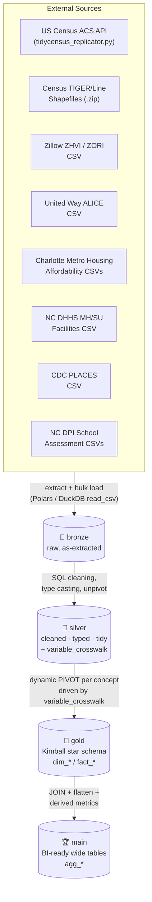
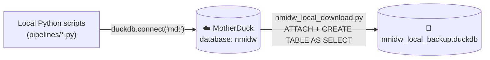

# North Meck Insights Data Warehouse (nmidw)

For long-term, centralized storage of the research data, the team developed a data warehouse in [DuckDB](https://duckdb.org/) that consolidates demographic, housing, health, education, and economic data for the North Mecklenburg towns of **Davidson, Cornelius, and Huntersville** (Mecklenburg County, NC). Data is pulled from the U.S. Census ACS, Census TIGER/Line geometry, Zillow, the United Way ALICE study, the Charlotte Regional housing affordability reference set, NC DHHS mental health/substance use facility listings, CDC PLACES, and NC DPI school assessment data. The pipeline follows a **medallion architecture**, a modern variation of the classic 3-layer data architecture (raw → clean → modeled). In the Bronze layer, the research team stages raw, unmodified data directly from their data sources. In the Silver layer, the raw data is then filtered, cleaned, and augmented to make it ready for modeling. Finally, in the Gold layer, the data is restructured into star schema data models to optimize it for reporting and analytics. Each of these stages has its own schema in the data warehouse, and a final layer of tables sits atop the Gold layer that provides direct access to the data from the website for the purposes of creating tables and visualizations, as well as producing data exports for end users. Finally, the data lands in a Kimball-style star schema, ready for BI tools, GIS, and ad-hoc analysis.The DuckDB database file is hosted on [MotherDuck](https://motherduck.com/), a cloud data warehouse platform with a free tier that is adequate for the research team’s needs.

NOTE: The code was written with CLAUDE AI assistance.

---

## Purpose

North Meck Insights uses this warehouse to answer community-needs-assessment questions that span multiple public datasets and geographies at once — e.g. *"How does housing burden in Huntersville compare to school proficiency and rates of uninsurance?"* Each source system ships its own format, geography, and vintage; this pipeline normalizes all of them onto a common set of dimensions (**block group**, **town**, **year**) so they can be joined directly in SQL or a BI tool without bespoke reconciliation every time. Also, the data warehouse serves for data automation purposes as well, leaving conveniance for adding data for future cohorts.

---

## Architecture

### Schema layers (medallion)

| Layer | Schema | Purpose |
|---|---|---|
| Bronze | `bronze` | Raw data exactly as extracted — CSV loads and Census API responses, no cleaning. |
| Silver | `silver` | Cleaned, typed, deduplicated data in a tidy (long) format. Includes the `variable_crosswalk` table that drives Gold-layer table generation. |
| Gold | `gold` | Kimball star schema — conformed dimensions (`dim_*`) and grain-level fact tables (`fact_*`), one row per `(geography, year)` or similar. |
| Main | `main` | Denormalized, BI-ready tables (`agg_*`) — Gold facts joined to dimensions and flattened into wide tables for dashboards, plus neighborhood-level rollups. |

### Medallion flow



Everything after the initial extract runs as SQL inside DuckDB/MotherDuck — no dataframe holds more than one pipeline's raw payload at a time.

### Cloud (MotherDuck) with local sync

The warehouse's system of record is a MotherDuck cloud database named `nmidw`. Every pipeline script connects straight to it — there is no local `.duckdb` file used as an intermediate. After a full run, a separate sync step clones the cloud database down to a local file for offline analysis, BI-tool connections, or backup.



`functions/mother_duck_connector.py` centralizes this connection: it reads `MOTHERDUCK_TOKEN` from `.env`, connects with `duckdb.connect("md:")`, and ensures the `nmidw` database exists before every pipeline runs.

> **Function-level reference:** see [docs/FUNCTIONS_REFERENCE.md](docs/FUNCTIONS_REFERENCE.md) for every function in `functions/mother_duck_connector.py` and `functions/tidycensus_replicator.py` — signatures, parameters, return values, and retry/validation behavior.

---

## Repository Structure

```
.
├── data_warehouse.py                  # Orchestrator: runs every pipeline in sequence (Bronze→Silver→Gold→Main)
├── nmidw_local_download.py            # Post-run: clones the MotherDuck cloud DB to a local .duckdb backup
│
├── functions/
│   ├── mother_duck_connector.py       # get_md_connection() — shared MotherDuck connection + token handling
│   └── tidycensus_replicator.py       # Python port of R's tidycensus: ACS extraction, chunking, retries, tidy unpivot
│
├── pipelines/                         # One script per source system; each owns its Bronze + Silver steps
│   ├── nmidw_census.py                # ACS block-group + place data (Bronze/Silver + variable_crosswalk)
│   ├── nmidw_geom.py                  # TIGER/Line block group + block boundary shapefiles (Bronze/Silver)
│   ├── nmidw_zillow.py                # ZHVI (home value) + ZORI (rent index) CSVs
│   ├── nmidw_alice.py                 # ALICE household financial hardship data (town + county)
│   ├── nmidw_charlotte.py             # Charlotte metro AMI affordability gap, housing wage, rent by bedroom
│   ├── nmidw_mh_su_facilities.py      # Mental health / substance use facility listings
│   ├── nmidw_cdc_places.py            # CDC PLACES town-level health measures (BRFSS-derived)
│   ├── nmidw_schools.py               # NC DPI school assessment, growth, and indicator data (10 source tabs)
│   ├── nmidw_gold.py                  # Builds the entire Gold star schema (dims + concept-driven facts)
│   ├── nmidw_aggregate.py             # Builds ~35 wide, town/school/facility-grain BI tables in `main`
│   └── nmidw_neighborhood_aggregate.py# Builds neighborhood-level rollups (5 focus neighborhoods) in `main`
│
└── data/                              # Local CSV/shapefile inputs read by Bronze steps (gitignored where large)
    ├── zillow/  alice/  charlotte/  healthcare/  school_assessment/
    └── tl_2023_37_bg/  tl_2023_37_tabblock20/    # cached/extracted TIGER shapefiles
```

> Unlike a typical migration-based warehouse, there is no `supabase/migrations`-style DDL history here — Gold is dropped and rebuilt from Silver on every run (`DROP SCHEMA IF EXISTS gold CASCADE`), and Silver/Bronze tables are recreated with `CREATE OR REPLACE TABLE`. The pipeline is idempotent by re-running it in full, not by incremental migration.

---

## Data Sources

| Source | Pipeline | Format | Geography |
|---|---|---|---|
| US Census ACS 5-Year (2018–2024) | `nmidw_census.py` | REST API (JSON) | Block group, place |
| Census TIGER/Line 2023 | `nmidw_geom.py` | Shapefile (.zip) | Block group, block |
| Zillow ZHVI / ZORI | `nmidw_zillow.py` | CSV | Town |
| United Way ALICE | `nmidw_alice.py` | CSV | Town, county |
| Charlotte Regional housing affordability | `nmidw_charlotte.py` | CSV | Region |
| NC DHHS MH/SU facilities | `nmidw_mh_su_facilities.py` | CSV | Facility (point) |
| CDC PLACES (BRFSS) | `nmidw_cdc_places.py` | CSV | Town |
| NC DPI school assessment (2024–25) | `nmidw_schools.py` | CSV (10 tabs) | School |

---

## Data Model

> **Full column-level reference:** see [docs/DATA_DICTIONARY.md](docs/DATA_DICTIONARY.md) for a table-by-table breakdown of every Gold dimension/fact and every Main-layer `agg_*` table (grain, source tables, and what each one computes). The sections below summarize the same material at a glance.

### Silver layer highlights

Most Silver steps follow the same pattern: expose each Bronze table as a `v_bronze_*` view, cast/trim/standardize into a permanent Silver table, then drop the view. The one structurally important exception is **`silver.variable_crosswalk`**, built in `nmidw_census.py`, which is what makes the Gold layer's fact-table generation dynamic and automatic rather than hand-written:

| Column | Description |
|---|---|
| `year` | ACS vintage year |
| `name` | Raw variable code with `E`/`M` suffix (join key back to Bronze) |
| `variable` | Base variable code (e.g. `B01003_001`) |
| `label_clean` | Human-readable column name derived from the ACS label (used as the pivoted column name) |
| `concept` | ACS concept text, cleaned of inflation-adjustment boilerplate |
| `table_name` | `fact_<slug of concept>` — the Gold fact table name (before the `_bg`/`_town` suffix) |

### Gold layer — Kimball star schema

**Dimensions** (`gold.dim_*`):

| Table | Grain |
|---|---|
| `dim_date` | 1 row per day, 1990–2050 |
| `dim_year` | 1 row per calendar year |
| `dim_bg` | 1 row per block group (GEOID, tract/county names, GeoJSON geometry) |
| `dim_block` | 1 row per 2020 Census block (geometry only — feeds neighborhood unions, no FK from facts) |
| `dim_town` | 1 row per place GEOID → Davidson / Cornelius / Huntersville / Other |
| `dim_county` | Single row, Mecklenburg County |
| `dim_region`, `dim_bedrooms`, `dim_ami_level`, `dim_occupation` | Support Charlotte housing-affordability facts |
| `dim_school`, `dim_subgroup`, `dim_subject_code`, `dim_grade_scope`, `dim_act_measure` | Support school-assessment facts |

**Concept-driven ACS facts** — the core of the star schema. For every distinct `table_name` in `silver.variable_crosswalk` (at the latest ACS vintage year) and for each geography (`bg`, `town`), the pipeline dynamically `PIVOT`s estimates and margins of error out of `silver.acs_bg` / `silver.acs_place`, builds a `CREATE TABLE` statement from the discovered columns, and inserts. This produces two tables per concept:

```
gold.{table_name}_bg     -- grain: 1 row per (block_group_GEOID, year_key)
gold.{table_name}_town   -- grain: 1 row per (place_GEOID, year_key)
```

e.g. `gold.fact_household_income_in_the_past_12_months_bg`, `gold.fact_median_value_dollars_town`, `gold.fact_race_bg`, `gold.fact_tenure_town` — dozens of tables generated this way, one pair per ACS concept actually ingested.

**Fixed (hand-written) facts:**

| Table | Grain | Source |
|---|---|---|
| `fact_zillow_home_value` | place × date × housing_type | `silver.zillow_zhvi` |
| `fact_zillow_rent` | place × date | `silver.zillow_zori` |
| `fact_alice_town_household` | place × year | `silver.alice_town_household` |
| `fact_alice_county` | county × year | `silver.alice_county` |
| `fact_mh_su_facilities` | 1 row per facility | `silver.mh_su_facilities_clean` |
| `fact_fair_market_rent` | region × year × bedroom | `silver.charlotte_rent_by_bedroom` |
| `fact_ami_affordability_gap` | region × year × bedroom × ami_level | `silver.ami_affordability_gap` |
| `fact_occupation_housing_wage` | region × year × occupation | `silver.charlotte_housing_wage` |
| `cdc_places` + 6 category facts (`fact_health_outcomes_town`, `fact_health_status_town`, `fact_prevention_town`, `fact_disability_town`, `fact_risk_behaviors_town`, `fact_social_needs_town`) | place × year | `silver.cdc_places` |
| 8 school fact tables (`fact_school_test_results`, `fact_school_growth`, `fact_school_hs_indicators`, `fact_school_assessment_master`, `fact_school_eog_eoc`, `fact_school_act`, `fact_school_workkeys`, `fact_school_english_learner`) | school × subgroup (× subject/growth type/grade scope where applicable) | `silver.school_*` |

### Main layer — BI-ready aggregates

`nmidw_aggregate.py` and `nmidw_neighborhood_aggregate.py` join Gold facts back to their dimensions and flatten them into wide `agg_*` tables — no further modeling required by BI tools. Grain is **town × year** for almost all of them, with a few exceptions:

| Category | Example tables | Grain |
|---|---|---|
| Demographics & health | `agg_town_demographics`, `agg_town_health_data`, `agg_town_health_insurance`, `agg_town_disability_status`, `agg_town_racial_equity_snapshot` | town × year |
| CDC PLACES | `agg_town_cdc_health_outcomes`, `_status`, `_prevention`, `_disability`, `_risk_behaviors`, `_social_needs` | town × year |
| Housing & economy | `agg_town_housing_burden`, `agg_town_housing_affordability_index`, `agg_town_housing_stability`, `agg_town_economic_trends`, `agg_town_home_value_trends`, `agg_town_rent_trends`, `zillow_market_affordability_index` | town × year |
| Education | `agg_town_educational_attainment`, `agg_town_school_enrollment`, `economic_mobility_education`, plus ~12 `agg_school_*` tables (proficiency, growth, graduation, race/disability gaps, college readiness, scorecard) | town × year / school-grain |
| Childcare & transportation | `agg_town_childcare`, `agg_town_transportation_access`, `analytics_infrastructure_accesibility` | town × year |
| ALICE | `agg_town_alice_household`, `agg_county_alice_household` | town × year / county × year |
| Charlotte regional reference | `agg_charlotte_fair_market_rent`, `agg_charlotte_ami_affordability_gap`, `agg_charlotte_occupation_housing_wage` | region × year (× bedroom/AMI/occupation) |
| Facilities | `agg_mhsu_facility_summary`, `agg_mhsu_facility_detail` | facility-grain |
| Neighborhood & geometry | `agg_neighborhood_demographics`, `_economic_profile`, `_housing`, `_education`, `_transportation`, `_childcare`, `agg_neighborhood_blockgroup_geometry`, `agg_neighborhood_blocks`, `agg_neighborhood_geometry_block` | neighborhood × block group × year (geometry tables: 1 row per neighborhood) |

**Neighborhood aggregation** approximates 5 "focus neighborhoods" (Huntington Green, Pottstown, West Davidson, Smithville, East Catawba) — which have no official Census geography — as hand-mapped groups of block groups, defined inline as a `neighborhood_map` CTE repeated in each aggregation query. Boundaries are unioned spatially from `gold.dim_bg.geometry` / `gold.dim_block.geometry` using DuckDB's `spatial` extension (`ST_Union_Agg`, `ST_GeomFromGeoJSON`).

> **Known data caveat:** block group `371190064111` is claimed by both the Smithville and East Catawba neighborhood mappings, which double-counts it in any neighborhood total that sums across both.

---

## Shared Utilities (`functions/`)

Every pipeline script imports from these two modules rather than duplicating connection or Census-API logic. (Also documented standalone in [docs/FUNCTIONS_REFERENCE.md](docs/FUNCTIONS_REFERENCE.md).)

### `functions/mother_duck_connector.py`

The single chokepoint every pipeline script uses to reach the warehouse — no script opens a `duckdb` connection any other way.

**`get_md_connection() -> duckdb.DuckDBPyConnection`**

Loads environment variables via `python-dotenv` (`load_dotenv()` runs at import time), opens a MotherDuck connection with `duckdb.connect("md:")` — which authenticates using the `MOTHERDUCK_TOKEN` environment variable, read implicitly by the MotherDuck DuckDB extension — then runs `CREATE DATABASE IF NOT EXISTS nmidw;` and `USE nmidw;` before returning the connection.

- **Parameters:** none.
- **Returns:** an open connection already pointed at the `nmidw` database.
- **Side effects:** creates the `nmidw` MotherDuck database on first call if it doesn't exist yet; prints a `☁️ Connecting to MotherDuck Cloud (nmidw)...` status line.
- **Caller responsibility:** every pipeline script calls this once near the top and must call `.close()` on the returned connection itself — the function doesn't manage the connection lifecycle beyond opening it.

### `functions/tidycensus_replicator.py`

A Python port of the parts of R's [tidycensus](https://walker-data.com/tidycensus/) package the warehouse needs: pulling ACS 5-year estimates for a set of variables/years/geographies and reshaping the response into tidy (long) format. Used exclusively by `pipelines/nmidw_census.py`.

Module-level constants (defined at the top of the file, **not** actually used by the functions below — every function takes these as explicit parameters instead, and `nmidw_census.py` passes its own copies in):

| Constant | Value | Notes |
|---|---|---|
| `CENSUS_API_KEY` | hardcoded string | See [Known Issues](#known-issues) — should move to `.env` like `MOTHERDUCK_TOKEN`. |
| `STATE_FIPS` | `"37"` | North Carolina |
| `COUNTY_FIPS` | `"119"` | Mecklenburg County |

**`chunk_variables(var_list, chunk_size=20) -> Iterator[list]`**

Generator that yields successive `chunk_size`-sized slices of `var_list`. Exists because the Census API rejects requests with too many variables in a single `get=` query string.

**`classify_variables(raw_vars) -> dict`**

Splits a mixed list of ACS variable codes into two buckets by table type, based on the code's first letter: codes starting with `S` (e.g. `S1501_C01_001`) go to `"subject"` (served by `/acs/acs5/subject`); everything else (`B`/`C` prefix) goes to `"detailed"` (served by `/acs/acs5`). Returns `{"detailed": [...], "subject": [...]}`.

**`get_safe_variables(year, raw_vars, table_type="detailed") -> list`**

Validates a list of variable codes against that year's real ACS metadata before requesting them, since not every variable exists in every vintage year. Fetches `.../variables.json` for the given year/table type and drops (with a logged warning) any variable missing from that vintage.

- **Returns:** the subset of `raw_vars` confirmed present in that year's metadata. **Fails open**: if the metadata request itself fails (non-200), returns `raw_vars` unchanged and lets the actual data request surface any error.

**`fetch_census_chunk(year, geography, variables, api_key, state_fips, county_fips, table_type="detailed") -> pl.DataFrame`**

Fetches **one chunk** (≤20 variables) from the Census API for a single year/geography and reshapes the wide JSON response into a tidy long DataFrame with columns `GEOID, NAME, variable, estimate, moe`.

- `geography` — `"block group"` (queries `for=block%20group:*&in=state:{state}%20county:{county}`) or anything else, treated as place-level (`for=place:*&in=state:{state}`).
- `table_type` — `"detailed"` requests both `E` estimate and `M` margin-of-error columns; `"subject"` tables only expose `E` columns, so MOE is filled with `NULL` rather than requested.
- `GEOID` is built by concatenating state+county+tract+block-group (block group) or state+place (place).
- **Raises** `ValueError` on a non-200 response. An empty API response (header row only) returns an empty `pl.DataFrame()` rather than raising.

**`fetch_acs_metadata(target_years) -> pl.DataFrame`**

Fetches ACS variable metadata (label + concept text) for every year in `target_years`, for both the detailed and subject endpoints, and stacks everything into one DataFrame with columns `year, name, label, concept`. This is the source of `bronze.acs_metadata`, which `nmidw_census.py` later turns into `silver.variable_crosswalk` — the table that drives dynamic Gold fact-table generation.

- If a given year/table-type metadata request fails, that combination is skipped with a warning rather than raising.

**`run_ingestion_pipeline(target_years, acs_variables_raw, geography, api_key, state_fips, county_fips) -> pl.DataFrame`**

The top-level orchestrator — the one function `nmidw_census.py` actually calls (once for `"block group"`, once for `"place"`). For every year in `target_years`, it:

1. Classifies `acs_variables_raw` into detailed/subject via `classify_variables`.
2. Skips subject tables entirely at `geography == "block group"` — the Census API does not support subject tables below place level.
3. Validates variables for that year via `get_safe_variables`.
4. Chunks safe variables via `chunk_variables` and calls `fetch_census_chunk` per chunk, concatenating results.
5. Retries the whole year/table-type combination up to 5 times (5s × attempt-number backoff) on any exception.
6. Tags the concatenated result with a `vintage_year` column and appends it to the running list.

- **Returns:** one `pl.DataFrame` — all years, all variables, all chunks concatenated — with columns `GEOID, NAME, variable, estimate, moe, vintage_year`.
- **Raises** `RuntimeError` if a year/table-type combination still fails after 5 retries — a hard stop, unlike `fetch_acs_metadata`'s per-year skip-and-continue.

**Call graph** (as used by `nmidw_census.py`):

```
run_ingestion_pipeline(geography="block group")  ──┐
run_ingestion_pipeline(geography="place")         ──┼──> bronze.acs_blockgroup / bronze.acs_place
fetch_acs_metadata(target_years)                  ──┘         bronze.acs_metadata

  each run_ingestion_pipeline() call internally chains:
  classify_variables → get_safe_variables → chunk_variables → fetch_census_chunk (× N chunks, × N years)
```

---

## Setup

### Prerequisites

- Python 3.11+
- A [MotherDuck](https://motherduck.com/) account and access token
- Packages: `duckdb`, `polars`, `requests`, `python-dotenv` (install via your preferred method — no `pyproject.toml`/`requirements.txt` exists yet in this repo)

### Environment variables

Create a `.env` file in the repo root:

```
MOTHERDUCK_TOKEN=your-motherduck-token
```

`functions/mother_duck_connector.py` loads this via `python-dotenv` and uses it implicitly through `duckdb.connect("md:")` (the MotherDuck DuckDB extension reads `MOTHERDUCK_TOKEN` from the environment).

### Running the full pipeline

```bash
python data_warehouse.py
```

This runs, in order: `nmidw_census → nmidw_geom → nmidw_zillow → nmidw_alice → nmidw_charlotte → nmidw_mh_su_facilities → nmidw_cdc_places → nmidw_schools → nmidw_gold → nmidw_aggregate → nmidw_neighborhood_aggregate`, each against the live MotherDuck `nmidw` database. `nmidw_gold.py` must run after all source pipelines (it reads every `silver.*` table); `nmidw_aggregate.py`/`nmidw_neighborhood_aggregate.py` must run after `nmidw_gold.py`.

### Syncing Cloud → Local

```bash
python nmidw_local_download.py
```

Removes any existing `nmidw_local_backup.duckdb`, then re-creates it by attaching it alongside the MotherDuck connection and running `CREATE OR REPLACE TABLE local_db.<schema>.<table> AS SELECT * FROM nmidw.<schema>.<table>` for every table in `bronze`, `silver`, `gold`, and `main`. Use this file for offline analysis or to point a local BI tool (e.g. DuckDB-compatible dashboards) at a point-in-time snapshot without touching the cloud database.

### Running a single pipeline

Each script in `pipelines/` can be run standalone (e.g. to refresh just one source):

```bash
python pipelines/nmidw_zillow.py
```

Note that `nmidw_gold.py` drops and rebuilds the *entire* Gold schema every time it runs, so re-running any single upstream Bronze/Silver pipeline requires re-running `nmidw_gold.py` (and the Main-layer scripts) afterward to propagate the change downstream.

---

## Adding a New Source Pipeline

1. Create `pipelines/nmidw_<source>.py` following the existing Bronze → Silver pattern: `get_md_connection()`, `CREATE OR REPLACE TABLE bronze.<source>_raw AS SELECT * FROM read_csv_auto(...)`, then a `v_bronze_*` view → cleaned `silver.<source>` table → `DROP VIEW`.
2. If the new source should join into the star schema, add its dimensions/facts to `nmidw_gold.py` (either as a fixed fact table, or — if it's ACS-shaped long data — feed it through `silver.variable_crosswalk` so Gold generates it automatically).
3. Add any BI-facing flattening to `nmidw_aggregate.py`.
4. Register the new script in `data_warehouse.py`'s execution sequence, in dependency order (source pipelines before `nmidw_gold.py`, which must run before the aggregate scripts).

---

## Known Issues

- **Census API key is hardcoded** in `functions/tidycensus_replicator.py` and `pipelines/nmidw_census.py` rather than loaded from `.env` alongside `MOTHERDUCK_TOKEN`. Since Census API keys are freely self-issued and rate-limit-only (not billing-sensitive), this is a lower-severity issue than a typical hardcoded credential, but it should still move to an environment variable before this key is shared or the repo is made public.
- **Neighborhood block group overlap:** GEOID `371190064111` is mapped to both the Smithville and East Catawba focus neighborhoods (see [Main layer](#main-layer--bi-ready-aggregates) above) — any cross-neighborhood total will double-count it.
- **Pre-2020 block group boundaries:** ACS vintage years 2018–2019 used block group boundaries retired in the 2020 redistricting; `gold.dim_bg.geometry` is `NULL` for ~200 retired GEOIDs from those years (2020–2024 vintages match current TIGER geometry 1:1).
